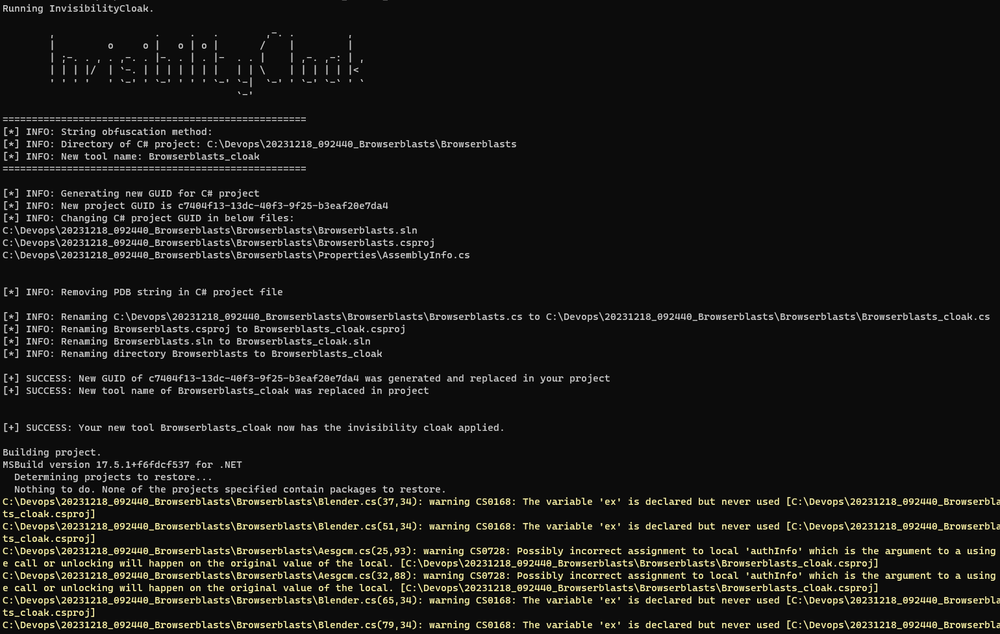
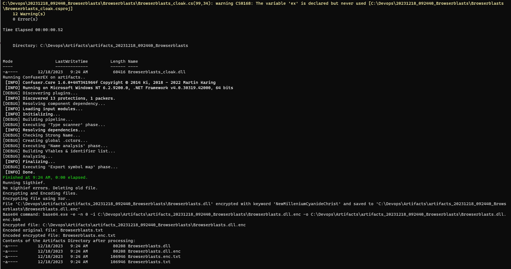

# PipelingNG

A little PoC devops pipeline in a box. Will perform string obfuscation, replace guid, pdb strings, etc, build, steal a signature from another binary, optionally runs confuser, optionally encrypt and base64 encodes all the artifacts before zipping.   

Installs the scripts and tools it needs to work into the workingFolder parameter path. Sigthief, InvisiblilityCloak, Confuser.cli.exe, skavencrypt. Temp and Artifacts are created here as well. Temp deletes itself, artifacts does not, so be mindful of how much space you're filling up. It really adds up quick. Something to add later.

Throw more powershell at it!





## Usage
Pretty straight-forward, check out the comments in the block below for explanations of the parameters.

### Params in a hashtable, until it is done

```powershell
$proj = "C:\git\MyAgent"
$projName = "MyAgent"
$params = @{
    newProjectFolderName = "$projName"
    workingFolder = "C:\Devops"    
    inputFolder = "$proj"
    signatureBinary = "$path\skavencryptiv\WINWORD.exe" # this will download as part of the script but can specify
    method = "rot13" # string obfuscation method rot13, reverse, base64, none
    confuser = $true # run confuser w/ 'aggressive' preset
    xor = $true 
    key = "NewMilleniumCyanideChrist" # xor key, default in the script as well if you choose xor and dont give a key
}
.\PipelingNG.ps1 @params
```

